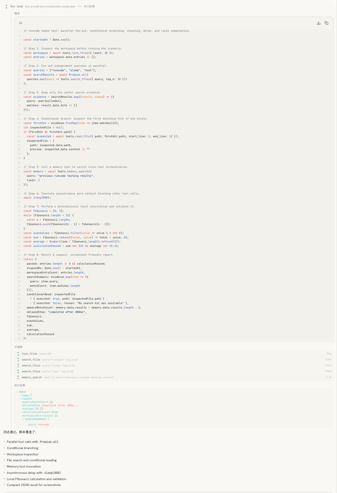

# codemode-go

[](https://pkg.go.dev/github.com/gtoxlili/codemode-go)
[](https://github.com/gtoxlili/codemode-go/actions/workflows/ci.yml)
[](https://goreportcard.com/report/github.com/gtoxlili/codemode-go)
[](LICENSE)

**面向 Go agent 的可编程工具调用。** 把 runtime 中已有的工具投影成一套 JavaScript API,由模型编写程序来调用,而不是一轮只发一次工具调用。无需替换现有的 agent 框架。

[English](README.md)



*八个步骤,三次检索并行执行各约 130 毫秒,五次子调用,返回一份结果。程序中途读取的内容全部留在进程内。*

## 核心抽象

用 Go 编写 agent 时,runtime 中本就存在一份工具表:`read`、`list`、`grep`、`edit`、`bash`,以及业务所需的其他工具。每一项本身就是"参数进、结果出"的函数,绑定它们只需一两行:

```go
bindings := []codemode.Binding{
    {Name: "list_files", Invoke: listFiles},
    {Name: "read_file",  Invoke: readFile},
    {Name: "grep",       Invoke: grep},
    {Name: "write_file", Invoke: writeFile, Mutating: true, ConflictKeys: pathKey},
}
tool := codemode.NewTool(codemode.Options{Bindings: bindings})
```

模型原先一次只能触达一个的那些能力,由此变成可以编程的对象:

```js
const listed = await tools.list_files({path: "src"});
const hits = await Promise.all(
  listed.data.entries.map(p => tools.grep({path: p, query: "TODO|FIXME"}))
);
const worst = hits
  .flatMap(h => h.data.matches)
  .filter(m => m.line < 50)
  .slice(0, 20);
await tools.write_file({path: "debt.md", content: worst.map(m => "- " + m.path).join("\n")});
return {found: worst.length};
```

由此得到两点。相互独立的调用真正并发执行,因为 `Promise.all` 提供的是实际并行,而"一次发出两个 tool call 并期待运行时替你并行"并不是。中间结果留在进程内,模型看到的是 `{found: 20}`,而不是为得出这个结论读过的四百行内容。

关键在于那份工具表。中间不存在协议边界:一个 `Binding` 就是一个名字加一个 `func(ctx, argsJSON) (string, error)`,Go 代码能调用的东西,程序中都能调用。

`write_file` 上多出的两个字段,是混合批量扇出得以安全执行的前提。只有 runtime 知道对 `src/a.go` 的写入不能与对同一文件的读取重叠,引擎没有工具的参数 schema,无法推断这一点。声明一次之后,读取不同文件依然并行,触及同一资源的调用则按程序发起的顺序串行。详见[调度](#调度)。

本项目从一个已在生产环境运行该能力的 agent 中抽取而来。

## code mode 是什么

给模型一个用于运行程序的工具,并把其余工具作为 API 暴露给这段程序。这一做法有多个名称:[Anthropic](https://www.anthropic.com/engineering/code-execution-with-mcp) 称之为 code execution with MCP,[Cloudflare](https://blog.cloudflare.com/code-mode/) 称之为 Code Mode,[CodeAct 论文](https://arxiv.org/abs/2402.01030)称之为 code-as-action。

本项目是嵌入自有 runtime 的库。被投影的是你自己的原语,MCP 只是这些原语可能的来源之一,agent 循环无需改动。详见[横向对比](#横向对比)。

## 解决什么问题

**上下文。** 中间结果留在进程内。扫描 50 条搜索命中只产生一条工具结果,下一轮无需继续携带其中最终未被采用的 45 条。Anthropic 那篇文章中的一个案例是从 15 万 token 降至 2000。

**真实的并行。** `Promise.all` 将调用放入并发池。等待模型在下一轮再发出一批 tool call 无法达到同样效果。

**本应由代码承担的逻辑。** 筛选、打分、按 key 关联两个来源,在程序中四行即可完成;交给模型推理则需先把数据全部载入上下文,再用一整段文字描述其处理过程。

它的设计是与直连调用并存,而非取代。多数轮次只有一两个工具调用,此时改走程序纯属额外开销;工具描述中说明了何时值得编写程序,模型据此自行判断。

## 安装

```bash
go get github.com/gtoxlili/codemode-go
```

需要 Go 1.25 以上。核心是纯 Go 的 goja 方案:[goja](https://github.com/dop251/goja) 本身,加上为其提供事件循环的 `goja_nodejs`,除这两项外没有其他依赖。不需要 cgo、Node、Deno,不启动子进程,不依赖容器。

## 用法

三步:绑定工具,挂载工具,补充 prompt。

```go
import "github.com/gtoxlili/codemode-go"

bindings := []codemode.Binding{{
    Name:   "search_files",
    Invoke: searchFiles, // func(ctx context.Context, argsJSON string) (string, error)
}, {
    Name:         "write_file",
    Invoke:       writeFile,
    Mutating:     true,
    ConflictKeys: func(args string) []string { return []string{"file:" + pathOf(args)} },
}}

tool := codemode.NewTool(codemode.Options{
    Bindings: bindings,
    Blocked: []codemode.Blocked{{
        Name:   "ask_user",
        Reason: "ask_user 会结束当前回合,程序内无法调用,如需提问请在编写程序之前进行",
    }},
})
```

`tool` 提供 `Name()`、`Description()`、`Parameters()` 和 `Call(ctx, argsJSON)`,这是一个工具调用循环所需的全部内容。`Prompt` 返回配套的 system prompt 段落:

```go
systemPrompt += "\n\n" + codemode.Prompt(codemode.PromptOptions{})
```

工具描述说明这个工具是什么、程序可以调用哪些工具。prompt 段落说明如何编写程序:一次调用 resolve 出的信封与直连调用一致,失败的调用 reject 为可 catch 的错误,哪些调用会并行,以及只有 return 值和 console 输出会回到对话中。

### 被排除的工具

`Blocked` 用于声明某个工具存在于模型的 tool list 中,但程序内不可调用。这些名字会出现在自动生成的描述的排除名单中;程序内若调用它,得到的是你填写的 `Reason` 作为该次调用的错误,而不是一句 unknown tool。

### 观察运行过程

`OnCall` 在每次子调用前后触发,`OnProgram` 每次运行触发一次,时机在程序开始之前:

```go
codemode.Options{
    Bindings: bindings,
    OnCall: func(ctx context.Context, ev codemode.CallEvent) {
        // ev.Seq, ev.Tool, ev.Args, ev.Phase, ev.Duration, ev.Err
        ui.Push(ctx, ev)
    },
    OnProgram: func(ctx context.Context, code, description string) {
        ui.Label(ctx, description) // "筛选 20 个候选人并打分"
    },
}
```

两个回调都在发起调用的 goroutine 上同步执行,回调过慢会拖慢程序。事件携带的是原始入参,不是摘要。

### 返回形状提示

工具协议只下发入参 schema,返回结构对模型不可见,因此程序中写 `r.data.hits` 属于猜测。`ReturnShape` 从 Go 返回类型推导出一行紧凑提示,用于工具描述的末尾:

```go
desc += "\n\nReturns `{data: " + codemode.ReturnShape[SearchResult]() + "}`."
// Returns `{data: {query, hits: [{path, line: num, snippet}], truncated: bool, cursor?}}`.
```

裸字段名表示字符串,其他类型带类型标注,`?` 表示 omitempty。`PromptOptions` 的 `ReturnShapes` 设为 `true` 时,prompt 段落会附带这套记法的说明;设为 `false` 时则完全不提及返回形状。

## 适配器

独立模块,核心包因此保持最小依赖。

### eino

```bash
go get github.com/gtoxlili/codemode-go/adapters/eino
```

```go
bindings, err := einocodemode.Bindings(ctx, myTools)
ct := codemode.NewTool(codemode.Options{Bindings: bindings})
myTools = append(myTools, einocodemode.NewTool(ct))
```

[eino](https://github.com/cloudwego/eino) 的工具不携带"是否写入""触及哪个资源"这类信息,因此转换出的 binding 中 `Mutating` 为 false、`ConflictKeys` 为 nil,调度器会将每个调用视为无冲突。返回的是普通切片,传入之前可以按需修改。

### MCP

```bash
go get github.com/gtoxlili/codemode-go/adapters/mcp
```

agent 的工具不必全部来自自身。其中一部分来自 runtime 所连接的 MCP server 时,这个适配器负责把它们一并绑定:

```go
discovered, err := mcpcodemode.Tools(ctx, mcpClient)
bindings = append(bindings, mcpcodemode.Bindings(discovered)...)
```

60 个 MCP 工具若全部进入模型的 tool list,即为每轮 60 份 schema。`Catalog(discovered)` 将它们渲染为一段文本,用于"程序可调用、但 tool list 不携带"这类工具的描述:

```go
ct := codemode.NewTool(codemode.Options{
    Bindings:    bindings,
    Description: intro + "\n\n" + mcpcodemode.Catalog(discovered),
})
```

此时必须自行提供描述,因为自动生成的那句话声明的是"程序可以调用你 tool list 中的工具",工具移出 tool list 之后该声明不再成立。

适用于 [mark3labs/mcp-go](https://github.com/mark3labs/mcp-go) 客户端,stdio、SSE、streamable HTTP、进程内几种 transport 均可。

## 横向对比

code mode 的各类实现常被当作同一类事物比较,实际上它们处于不同层级。层级决定了一个项目究竟是本库的替代品,还是完全不同的东西。

**嵌入宿主、投影宿主自有工具的库。** 抽象边界与本库相同:你提供一个名字、一份 schema、一个 handler,它向模型提供一套可编程 API,agent 循环仍归你所有。

| 项目 | 宿主语言 | 模型编写 | 执行环境 | 工具的传入形式 |
|---|---|---|---|---|
| **codemode-go** | Go | JavaScript | goja,进程内 | `Binding{Name, Invoke}` → `tools.name(args)` |
| [tool-sandbox](https://github.com/domdomegg/tool-sandbox) | TypeScript | JavaScript | WASM | `Tool{name, inputSchema, handler}` → `tool(name, args)` |

**自带 code mode 的 agent 框架或 runtime。** 思路相同,但循环由它掌控,采用它意味着同时采用它的 agent 模型。

| 项目 | 宿主语言 | 模型编写 | 执行环境 |
|---|---|---|---|
| [deepseek-harness Code Mode](https://github.com/deepseek-ai/deepseek-harness) | TypeScript | TypeScript | 每次运行一个新的 Node worker |
| [Microsoft Agent Framework CodeAct](https://github.com/microsoft/agent-framework/blob/main/docs/decisions/0024-codeact-integration.md) | Python、.NET | Python | Hyperlight,backend 保持可插拔 |
| [smolagents CodeAgent](https://github.com/huggingface/smolagents) | Python | Python | 受限解释器,或 E2B / Docker |
| [strands-code-agent](https://github.com/aws-samples/sample-strands-code-agent) | Python | Python | 常驻 REPL,三种 backend |

这两张表并非完整调研,只收录处于同一抽象边界的项目,因为只有在同一层级上比较才有意义。那些位于多个 MCP server 之前的独立 server 回答的是另一个问题,不是本库的替代品,原因见[常见问题](#它是能加进-claude-code-的-mcp-server-吗)。

**优势。** 纯 Go、单进程,程序与工具之间不存在协议边界,也不对 agent 循环提出任何要求。上述项目中,只有本库依据声明的资源冲突进行调度,而非直接放行全部调用:`Mutating` 和 `ConflictKeys` 是宿主用以说明"这次调用会写入文件 X"的手段,而这件事只有宿主知道。引擎之外还包含:system prompt 段落、面向模型自修正编写的失败分类,以及每次子调用前后的钩子。单次运行的启动开销是一个 goja VM,微秒级,因此只调用两个工具的程序同样划算。

**局限。** 它不是安全边界,详见下文;确实需要安全边界时,上表中基于 WASM 和容器的方案更强。模型编写的是 JavaScript 而非 Go,工具只能经由传入的 binding 触达,无法将 Go 值直接交给程序。它也不生成带类型的 SDK,模型依据工具描述编写代码,而不是依据带自动补全的 TypeScript 类型,`ReturnShape` 缩小了这一差距但未能消除。此外,程序与宿主共用同一进程的内存,因此内存那道护栏是带已知误差的触发线,而非硬性上限。

## 程序可见的内容

| 名称 | 语义 |
|---|---|
| `tools` | `tools.name(args)` 返回 Promise,resolve 为该工具的结果,若为 JSON 则已解析 |
| `ToolCallError` | 调用失败时 reject 的错误,带 `.toolName`,catch 之后可继续执行 |
| `console` | log/info/warn/error/debug,写入同一条日志通道 |
| `sleep(ms)` | 唯一的等待方式,`setTimeout` 系列不存在 |

以及 JavaScript 语言内建,没有其他内容。没有文件系统、网络、`require`、`process`、`fetch`,所有对外效果都必须经过传入的绑定。

真正的边界是上述这份能力清单。其余部分需要明确说明:**这不是安全沙箱。** 程序在进程内运行 goja,而 goja 没有 per-VM 内存上限,也没有指令计数钩子,因此墙钟、计算预算、内存行程采用每 50 毫秒采样一次,再通过 goja 的 `Interrupt` 执行。

采样决定的是判定精度,而非终止速度。内存暴涨几乎立即越线,一段翻倍拼接的字符串在默认 256MB 下约 200 毫秒即被终止;而只进行计算的死循环需要等到计算预算耗尽,默认为两分钟。这两类都是模型可能无意写出的程序。它拦不住有意绕过限制的人。

## 资源护栏

| 护栏 | 默认值 | 说明 |
|---|---|---|
| 墙钟 | 10 分钟 | 先 Interrupt,5 秒宽限后强制停止 |
| 计算预算 | 2 分钟 | 只计入真正执行 JS 的时间,等待工具不计入 |
| 内存 | 256 MB | 相对运行起点的堆增量,判定终止前强制 GC 复核一次 |
| 子结果累计 | 64 MB | 逐字节记账,不采样 |
| 调用深度 | 8192 | |
| 并发子调用 | 8 | `Promise.all` 获得的并行度 |
| 单次运行子调用总数 | 200 | |
| console 输出 | 200KB / 2000 行 | 触顶即判定失败,保留已收集的部分 |

均可通过 `Options.Limits` 覆盖。零值表示采用默认值,这对只填写部分字段的结构体是合理的,对来自配置文件的值则不然:一个被写成 0 的 `wall_clock` 会静默变为 10 分钟,`Validate()` 正是用于报出这类取值。

计算预算与墙钟的区别在于计量口径。扇出 20 个慢接口可以运行数分钟而不消耗计算预算,因为这些时间并未用于执行 JavaScript;`while (true) {}` 则会在 2 分钟内耗尽计算预算,远早于墙钟。工具慢和程序失控是两个问题,由两道护栏分别处理。

## 失败

失败带有分类,每一类对应模型的一条自修正路径。错误正文面向模型编写,并附上程序终止前打印的尾部日志。

| 分类 | 应对方式 |
|---|---|
| `exception` | 修正语法或逻辑 |
| `timeout` | 收窄循环,减少调用 |
| `compute-limit` | 减少计算量,这一条与工具慢无关 |
| `memory-limit` | 不要构造无界的字符串和数组 |
| `result-limit` | 在代码中筛选或聚合,不要全量持有 |
| `output-limit` | 减少打印,改用 return |
| `invalid-return` | 返回可 JSON 序列化的数据 |
| `too-many-calls` | 无需修正,这是有意中止 |
| `aborted` | 无需修正,调用方已取消 |

单个子调用失败不会判定整次运行失败:它 reject 为程序可 catch 的 `ToolCallError`,一个数据源不可用不至于丢弃已完成的工作。未 `await` 的调用照常执行,失败时以 `[unhandled rejection]` 日志行呈现,不会静默消失。

## 调度

调用按程序发起的顺序启动。普通调用进入 `MaxParallel` 并发池。与在途调用共享 `ConflictKeys`、且两者至少一方会写入的调用,先等待池清空,再独占运行。

key 由工具自行计算,而非由运行时计算。运行时不认识任何工具的参数 schema,只有工具知道这次调用触及了什么。共享后端返回常量,资源 id 返回 `"deck:" + id`,文件返回绝对路径。key 按字符串比较,因此 `out/a.jpg` 与 `./out/a.jpg` 是两个 key,两者之间的冲突不会被发现。

调用一旦结束即从冲突面中移除,因为两个调用只在重叠期间才构成冲突。否则,先写入一份摘要再批量读回一批文件(包括刚写入的那份),整个读取扇出会被一个已经完成的写操作串行化。

## 常见问题

### 它是能加进 Claude Code 的 MCP server 吗

不是。它是供你正在编写的 agent 使用的库,而不是注册进他人客户端的 server。

那种形态确实存在于别处,并且有一个值得了解的结构性限制:MCP 是不对称的。server 侧暴露 tools,client 侧暴露 roots / sampling / elicitation,协议中没有任何机制允许 server 反向调用 client。因此网关无法触达 Claude Code 的 Read、Edit 或 Bash,只能编排它自己连接的上游 server;而要从网关获得收益,就需要把 MCP server 全部移到它之后,同时放弃直连。若一批 MCP 工具就是全部问题所在,这笔交易是合理的;但对于"把 runtime 自身的原语变为可编程"这个目标,它并不适用。

### 这是安全沙箱吗

不是。能力省略这一层是真实的:程序没有文件系统、网络和 import,所有效果都必须经过传入的 binding。资源护栏则是另一回事,它是采样触发线,能拦住模型无意写出的程序,拦不住有意绕过的人。

### 为什么是 JavaScript 而不是 Go

因为模型编写 JavaScript,而 goja 能在进程内执行它,不需要 cgo、子进程或容器。让模型编写 Go 则意味着需要工具链、编译步骤,并且要先完成隔离才能执行第一行。模型编写 JavaScript 的数量也远多于 Go,这直接体现在程序一次写对的比例上。

### 它会取代普通的工具调用吗

不会。它的设计就是与直连调用并存:多数轮次只有一两个调用,此时改走程序纯属额外开销;工具描述中说明了何时值得编写程序,模型据此自行判断。

### 究竟能节省多少上下文

完全取决于工具返回多少数据、答案又需要其中多少。节省下来的正是程序丢弃的那部分:扇出 50 条结果只 return 5 条,其余 45 条从未进入对话。Anthropic 那篇文章测得的一个案例是 15 万 token 降至 2000。只取一样东西再原样返回的程序,不会带来任何节省。

### 必须使用 MCP 吗

不必。MCP 只是工具的来源之一,为它提供了适配器。一个 `Binding` 就是一个名字加一个 `func(ctx, argsJSON) (string, error)`,Go 中能调用的东西都可以作为工具。

### 支持哪些 Go agent 框架

都支持,也都不绑定。核心产出的是名字、描述、JSON Schema 和一个 `Call`,接入你已有的循环即可。[eino](https://github.com/cloudwego/eino) 和 MCP 客户端有现成适配器。手写的 OpenAI 或 Anthropic SDK 循环大约五行接入。

### 需要安装 Node、Deno 或 Docker 吗

不需要。goja 是纯 Go 实现的 JavaScript 引擎,程序在你的进程内运行。

### 模型写出死循环会怎样

约两分钟后由计算预算终止,远早于墙钟。模型收到一条 `compute-limit` 失败,内容是要求减少计算量,并附上程序停滞之前打印的日志。`try/catch` 无法吞掉这个中断,有测试覆盖这一点。

### 程序内可以再调用一次程序吗

不可以。这个工具将自身排除在自己的绑定集之外,其名字还是描述中排除名单的第一项,模型可以看到。

## 延伸阅读

- [Code execution with MCP](https://www.anthropic.com/engineering/code-execution-with-mcp),Anthropic,把问题讲得最清楚的一篇
- [Code Mode: the better way to use MCP](https://blog.cloudflare.com/code-mode/),Cloudflare
- [Executable Code Actions Elicit Better LLM Agents](https://arxiv.org/abs/2402.01030),CodeAct 论文,量化数据的起点

## 状态

v0.x。引擎已经稳定并在生产环境使用,外围 API 仍可能调整。欢迎提交 issue 和 PR。

MIT。
